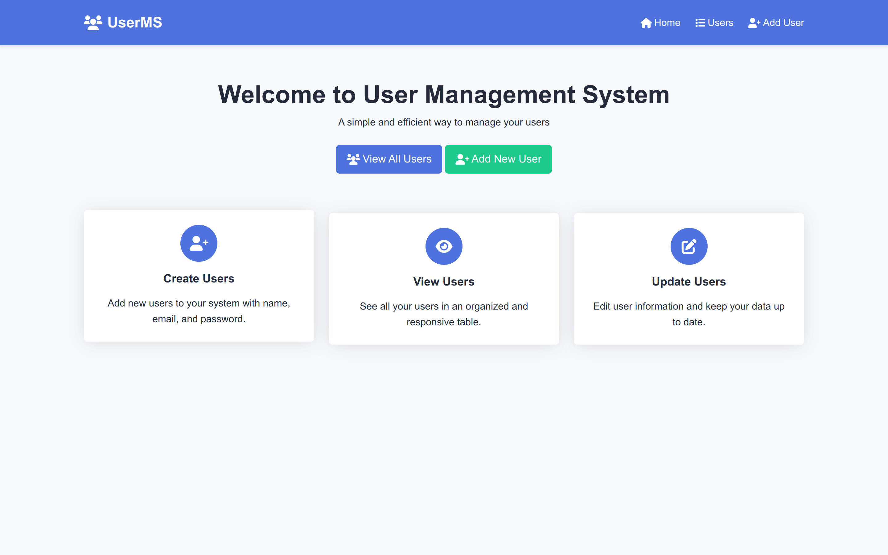

# User Management System

A simple and efficient PHP application for managing users. This system provides a complete CRUD (Create, Read, Update, Delete) interface with a clean, responsive design.



## Features

- **User Management**: Create, view, update, and delete users
- **Secure Password Storage**: All passwords are securely hashed using PHP's password_hash
- **Responsive Design**: Works on desktop and mobile devices
- **Clean UI**: Intuitive and user-friendly interface
- **Input Validation**: Basic form validation for data integrity
- **Database Integration**: MySQL database integration with PDO

## Requirements

- PHP 7.2 or higher
- MySQL 5.7 or higher
- Web server (Apache, Nginx, etc.)
- PDO PHP extension
- mod_rewrite enabled (for clean URLs)

## Installation

1. **Clone the repository**
   ```bash
   git clone https://github.com/nathakusuma/UserMS.git
   cd UserMS
   ```

2. **Create database**
   ```bash
   mysql -u root -p < database.sql
   ```

3. **Configure environment variables**
   ```bash
   cp .env.example .env
   ```
   Then edit the `.env` file with your database credentials.

4. **Set up web server**
    - For Apache, ensure the directory is in your web root
    - For Nginx, configure a server block pointing to the project directory

5. **Set proper permissions**
   ```bash
   chmod 755 -R /path/to/project
   chmod 777 -R /path/to/project/tmp   # If you have a tmp directory
   ```

## Configuration

1. Edit the `.env` file with your database connection details:
   ```
   DB_HOST=localhost:3306
   DB_NAME=user_management
   DB_USER=yourusername
   DB_PASS=yourpassword
   ```

2. Make sure your web server is configured to serve the application from the project root directory.

## Usage

1. Access the application through your web browser:
   ```
   http://localhost
   ```
   or whatever URL corresponds to your setup.

2. From the homepage, you can:
    - Navigate to the user list
    - Add a new user
    - View, edit, or delete existing users

## Project Structure

```
user-management-system/
├── config/             # Configuration files
│   ├── database.php    # Database connection class
│   └── env.php         # Environment variable loader
├── css/                # Stylesheets
│   └── style.css       # Main CSS file
├── includes/           # Reusable components
│   └── header.php      # Header template
├── models/             # Data models
│   └── User.php        # User model with CRUD operations
├── views/              # View files
│   └── users/          # User-related views
│       ├── create.php  # Create user form
│       ├── delete.php  # Delete user handler
│       ├── edit.php    # Edit user form
│       ├── list.php    # List all users
│       └── view.php    # View user details
├── .env.example        # Example environment variables
├── .gitignore          # Git ignore file
├── database.sql        # Database schema
├── index.php           # Application entry point
└── README.md           # Project documentation
```

## Key Components

### Database
The application uses MySQL with the following schema:
- `users` table with fields for id, name, email, password, created_at, and updated_at

### Models
- `User.php` provides methods for CRUD operations on user data

### Views
- Separated into logical components for each action
- Consistent styling across all pages
- Responsive design that works on mobile and desktop

## Security Features

- Password hashing using PHP's built-in `password_hash()` function with BCRYPT
- Input sanitization to prevent XSS attacks
- PDO prepared statements to prevent SQL injection

## Future Improvements

- Add user authentication/login functionality
- Implement user roles and permissions
- Add pagination for the user list
- Add search and filtering options
- Add form validation via JavaScript
- Implement a proper routing system

## License

This project is licensed under the MIT License - see the [LICENSE](LICENSE) file for details.
